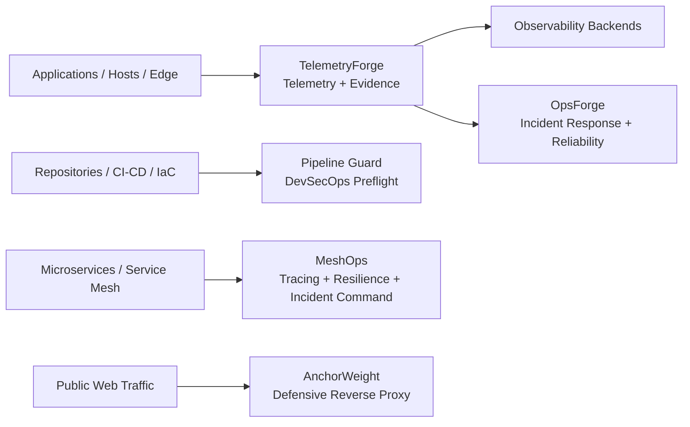

# Dan Fuhr

**Site Reliability Engineering · Infrastructure Engineering · Observability · DevSecOps · Distributed Systems · Denver, Colorado**

I build production-oriented infrastructure and reliability systems: distributed telemetry, incident-response platforms, CI/CD security tooling, cloud infrastructure, APIs, automation, and operational software.

My background spans software engineering, IT operations, enterprise systems, and business-critical production support. I focus on failure modes, observability, security boundaries, controlled automation, and evidence-backed reliability.

## Flagship Engineering

### [TelemetryForge](https://github.com/fuhrdan/TelemetryForge)

**Global edge telemetry fabric · Go · OpenTelemetry · Kafka · Kubernetes · Terraform · Multi-cloud**

Durable multi-cloud telemetry ingestion with replicated WAL acceptance, global routing, cryptographic lineage, policy controls, replayable investigations, formal verification, and evidence-producing performance/proof harnesses.

**Engineering proof:** [architecture](https://github.com/fuhrdan/TelemetryForge/tree/main/docs/architecture) · [ADRs](https://github.com/fuhrdan/TelemetryForge/tree/main/docs/adr) · [performance](https://github.com/fuhrdan/TelemetryForge/tree/main/docs/performance) · [operational proof](https://github.com/fuhrdan/TelemetryForge/blob/main/docs/performance/operational-proof.md)

### [OpsForge](https://github.com/fuhrdan/OpsForge)

**Incident response / NOC platform · C# · .NET 8 · Distributed agents · Reliability engineering**

Authenticated Windows agents feed persistent telemetry into deterministic incident correlation, topology/blast-radius analysis, RBAC, audit logging, SLA/error-budget analytics, maintenance windows, and Preview → Execute → Verify remediation.

### [Pipeline Guard](https://github.com/fuhrdan/Pipeline-Guard)

**DevSecOps repository preflight · CI/CD · Containers · Kubernetes · Terraform/IaC · Supply chain**

Local-first repository auditing with line-level findings, cross-file correlation, auditable suppressions, security scoring, optional OSV intelligence, and standalone reporting without uploading source code for normal analysis.

## Systems Portfolio

| Project                                                 | Engineering focus                                                                                    |
| ------------------------------------------------------- | ---------------------------------------------------------------------------------------------------- |
| [MeshOps](https://github.com/fuhrdan/MeshOps)           | Service-mesh incident command, Istio, mTLS, canary releases, tracing, resilience and chaos exercises |
| [AnchorWeight](https://github.com/fuhrdan/AnchorWeight) | Defensive reverse proxy, Proof-of-Crawl, trust boundaries, quarantine policy, security operations    |
| [TrustFix](https://github.com/fuhrdan/trustfix.ai)      | Laravel/MySQL production application, role-based workflows, security logging and administration      |

## Architecture-First Engineering

## What I Optimize For

* Reliability under failure, not just the happy path
* Durable evidence and explicit operational contracts
* Bounded retries, backpressure, idempotency, and controlled degradation
* Security boundaries, least privilege, auditability, and safe remediation
* Reproducible CI, release gates, architecture documentation, and ADRs
* Measured performance without invented benchmark claims

## Current Focus

**SRE · Platform / Infrastructure Engineering · Observability · DevOps / CI/CD · Cloud · Security Engineering · C# / .NET · Go**

## Links

🌐 [Lakehouse Software](https://lakehousesoftware.com)
💼 [LinkedIn](https://linkedin.com/in/danielfuhr/)
🎮 [Newlands Games](https://newlands-games.com/)
